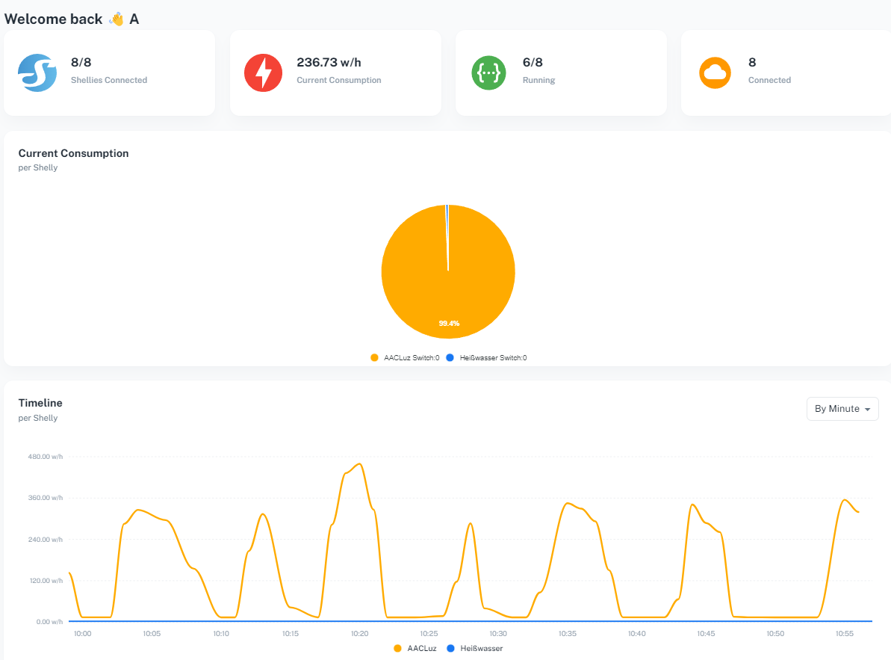
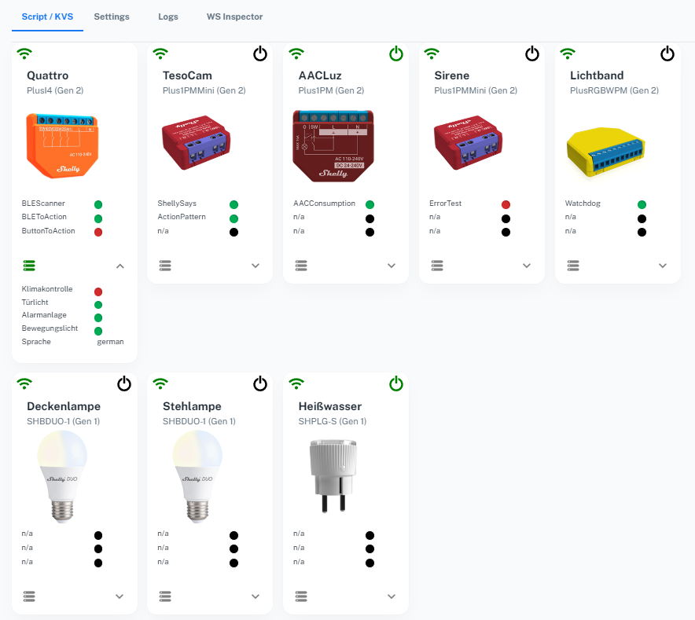
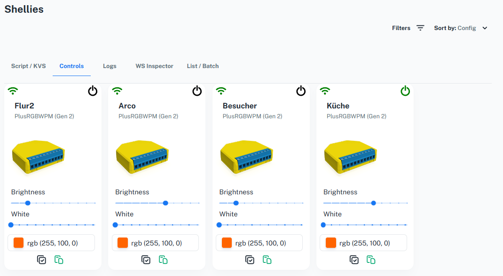
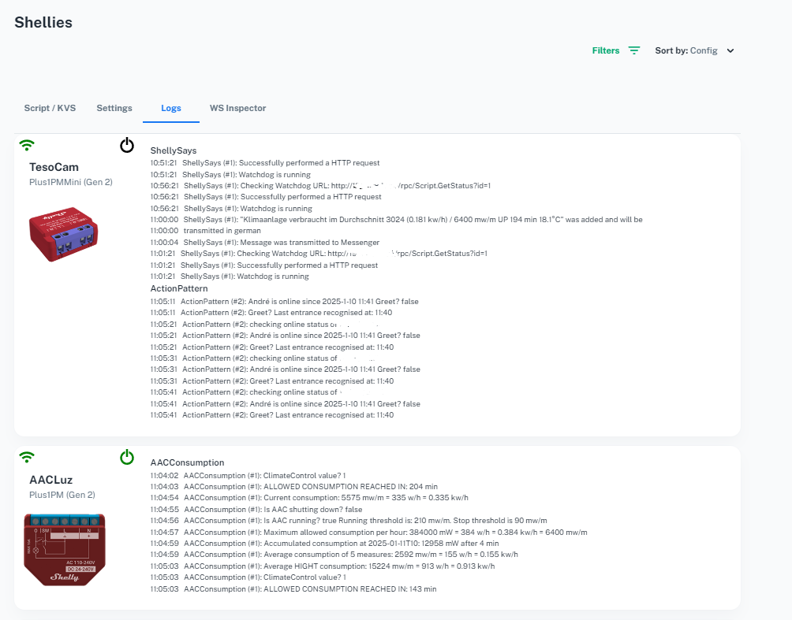
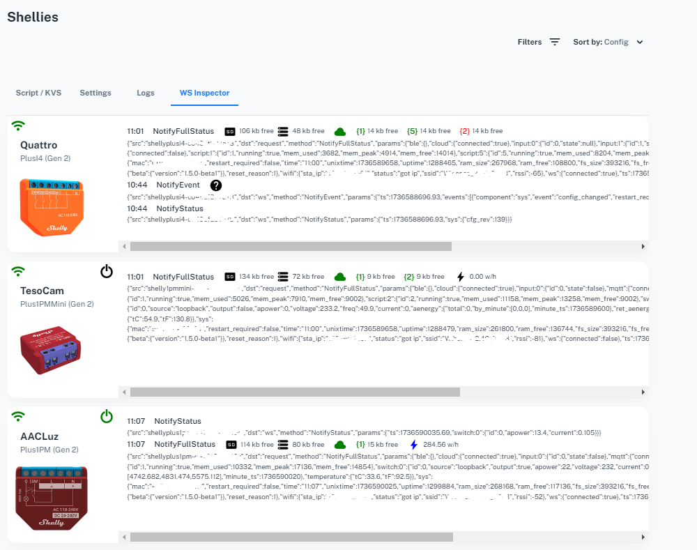
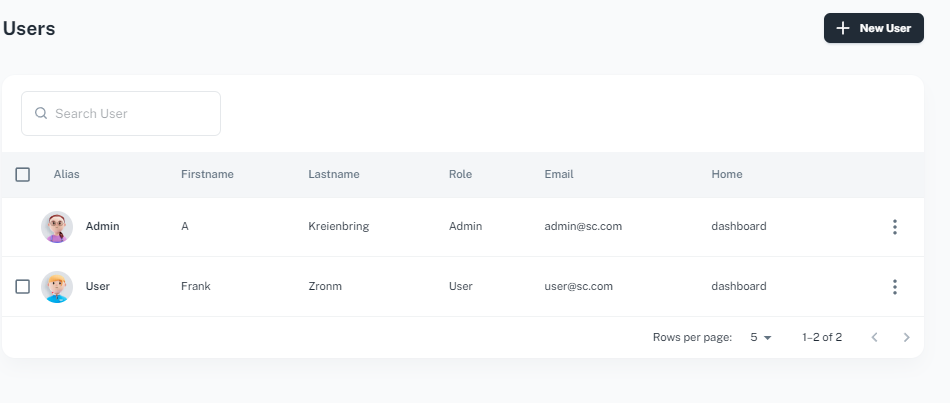
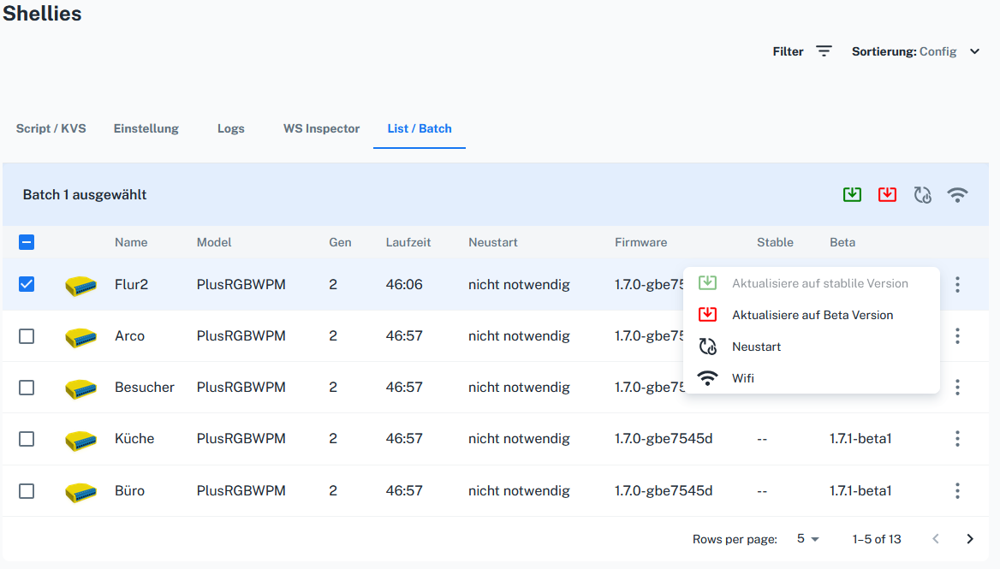

# S-Central


Shelly Dashboard / Monitor for Shelly Devices in your Smarthome

## Overview

S-Central is a client (React) / server (nodejs) application to monitor and control your Shelly devices. The server collects all relevant information about your devices by using RPC calls and websocket connections. The client is a webapplication that makes monitoring and controlling your Shellies easy. <br/>
S-Central is cloudless. That means it makes you (sort of) independent from the Shelly Cloud Control Center.

The server must run in your local network and acts as a broker between your Shellies and the client application. The communication with the client is strictly websocket based.

## Features

S-Central supports English, Spanish and German.

- **Dashboard**<br/>
  Informs you about connected Shellies, current and timelined consumption, running scripts, cloud connection.
- **Shellies**<br/>
  Get insights about KVS values, script status, Logs and websocket messages. Control your switches. Get notified when a script error occurs.<br/>
  Reboot, update the Firmware or edit the WIFI settings of many Shellies at once.
- **User**<br/>
  Enable additional users to log in to the appplication and assign specific Shellies to them.
- **Blog**<br/>
  A simple interface to write internal articles or notes to be displayed on the landing page.
- **Webservices**<br/>
  An API to call essential functions, e.g. from within your scripts.
- **General**<br/>
  Supports Gen1 und Gen2+ device authentication.

## Why use it?

Managing / Monitoring many Shellies in a network is a challenge. With S-Central you have the overview. How do you switch your relays? The original Shelly Control app (or Alexa) is a good choice. But both are cloudbased. Hence you need an internet connection to control your devices No Internet - no switch. S-Central needs only Wifi and your local network. So you can also look at it as an emergancy fallback. It is Open Source and transparent. You are welcome to participate and enhance the features.

## Supported operating systems (OS)

- Server: Needs nodejs be installed in your local network. Node ist available for Windows, MacOs, Linux and AIX.
- Client: Runs in the browser, hence is OS independent. Desktop and Smartphones are supported thanks to the responsive design of Material UI!

## How to install the erver with the included Client release

- **Prerequisites**<br/>
  Install nodejs. Normally it includes the NPM packet manager. I tested the system with nodejs 20.x.
- **Server (Client included)** <br/>
  Download the server release and unzip it in a directory of your choice. E.g. _/sb_ (Shelly Broker). Normally you run the server on a dedicated always-on-system. Like a NAS, a Rasberry or any other OS that can run nodejs. Navigate to that directory and type _npm install --force_. It might take a while untill all modules are downloaded. In the meantime you could...

  **Configure your Shellies**<br/>
  Add the IP addresses and custom names of your Shellies to the file _/sb/config/devices.json_. An example is included. <br/>

  **Configure the display of KVS values**<br/>
  In the file _/sb/config/kvsdisplays.json_ you can map KVS values to display names for convenience. An example is included.

  **Configure to your needs**<br/>
  It strongly recommended to change at least the default values of password and secret in _/sb/config/default.json_. Also you need to configure IP
  addresses and ports.<br/>
  Read the [Configuration details](#server-configuration) below!<br/>
  The settings you must / should change before the first run are marked with (!).

- **Client**<br/>
  The server release includes the current client version. But if the client version gets updated, you might want to install the newer version.<br/>
  Download the client release and unpack the content into the _/sb/public_ folder.

## Starting / stopping the server<br/>

- Linux: _npm start_ / _npm stop_
- Windows: _node shellybroker.js_ / CTRL-C

  Thats it! Navigate your browser to \[YOURSERVERIP]:3031 and log in with *admin@sc.com* and password _undlos_

## Be carefull using the WIFI settings update!

When changing the SSID or the password of a device, it may loose it's network connection! I recommend the following order

1. Enable the Accesspoint **BEFORE** changing the SSID / Password on the Shelly device
2. Configure your WIFI router to the same settings
3. Configure the computer where the S-Central server is running on.
4. Configure the computer you're running S-Central client on.
5. Allways have a fallback strategy

## The Log feature for Shelly scripts

Before firmware 1.7.0 the log outputs of a Shelly can not directly be associated with the script that produces them :-(
So to get this working you need to preceed every output with the name of the Script. For example you may use a CONFIG Object like

```
  const CONFIG = {
    // 'MyScriptname' must match the real name of the script!
    logPrefix: 'MyScriptname (#' + Shelly.getCurrentScriptId() + '): ',
  }
```

and then a function like

```
  //log with prefix to console
  function log(to_log) {
  console.log(CONFIG.logPrefix, to_log);
  }
```

to output messages to the console prefixed by script name and script id<br/>
Since Firmware 1.7.0 `console.log` (without prefix) can also be captured by S-Central<br/>
There are two example scripts provided in _/sb/examples/scripts_. Feel free to install them on one of your Gen2+ devices.
Look up the [Shelly documentation](https://shelly-api-docs.shelly.cloud/gen2/Scripts/Tutorial/) to find out how this is done.

## How to call the webservice endpoints

In situations where you need to inform the server about some status, you can call an endpoint from within your script. E.g. to set a device offline:<br/>

```

  let url = http://[ServerIP]/ws/v1/SetDevice?secret=[SECRET]&ip='[deviceIP]';
  let body = JSON.stringify({online: false});

  Shelly.call('HTTP.POST', {url: url, body: body});

```

Example that acknowleges the server that a script is not running:

```

let url = http://[ServerIP]/ws/v1/SetScript?secret=[SECRET]&ip='[deviceIP]&id='[scriptID]';
let body = JSON.stringify({running: false});

Shelly.call('HTTP.POST', {url: url, body: body});

```

See _/sb/server.js_ for all available entpoints

## When to restart the server

The server must be restartet when

- You add / change / delete a device in _/sb/config/devices.json_
- You add / delete a script on a device
- You add / delete a KVS key<br/>
- You change server configuration values<br/>

because of performance reasons this information is only retrieved on Server startup.

## Server Configuration

**Check/ Change the Settings marked with (!) and rename the _example_ files!**

File: _/sb/config/devices.json_

| Option    | Value             | Description                                         |
| --------- | ----------------- | --------------------------------------------------- |
| ip (!)    | xxx.xxx.xxx.xxx   | IP Address of a Shelly Device. Please use fixed IPs |
| cname (!) | e.g. 'Floorlight' | Display name for the client                         |
| password  | text              | (optional) If the device is protected               |

File: _/sb/config/kvsdisplays.json_

| Option      | Value            | Description                                                |
| ----------- | ---------------- | ---------------------------------------------------------- |
| display (!) | the display name | Mapping the KVS key to a display name                      |
| style       | 'color'          | Style of the KVS value. Omit this to show the value itself |

File: _/sb/config/default.json_

| Option               | Value                    | Description                                                                                                       |
| -------------------- | ------------------------ | ----------------------------------------------------------------------------------------------------------------- |
| **HTTP server**      |
| host (!)             | xxx.xxx.xxx.xxx          | The IP address of the HTTP server (nodejs)                                                                        |
| port                 | TCP Port                 | The TCP port of the HTTP server. Defaults to 3031                                                                 |
| UDP server           |
| host (!)             | xxx.xxx.xxx.xxx          | The IP of the UDP server. Must be configured in the Shelly device                                                 |
| port                 | UDP Port                 | The UDP port of the UDP server. Defaults to 3031                                                                  |
| **Websocket server** |
| host (!)             | xxx.xxx.xxx.xxx          | The IP of the Websocket server                                                                                    |
| port                 | TCP Port                 | The TCP port of the Websocket server. Defaults to 3031                                                            |
| ping-interval        | nr. of seconds           | Websocket keep-alive interval to check if the client is connected                                                 |
| unblock-interval     | nr. of seconds           | Security feature. After this time a blocked client is unblocked                                                   |
| messagelimit         | number                   | Security feature. Number of allowed WS messages per minute                                                        |
| secret (!)           | secret text              | Security feature. Is exchanged between WS client and server                                                       |
| **Shelly config**    |
| set-udp              | true / false             | If true, all shellies are configured to sent UDP Logs                                                             |
| set-ws               | true / false             | If true, all shellies are configured to send WS messages to the server (Reboots the Shelly on every server start) |
| **Database**         |
| standardpw (!)       | text                     | Standard password for all created users                                                                           |
| standardal           | text                     | Standard alias for the admin user (Created on first run)                                                          |
| standardem           | email                    | Standard email for the admin user (Created on first run)                                                          |
| standardhome         | 'dashboard' / 'shellies' | Standard homepage for all created users                                                                           |

## Client Configuration

Check/ Change the Settings marked with (!)

File: _/sb/public/index.html_

| Option          | Value              | Description                                                                                    |
| --------------- | ------------------ | ---------------------------------------------------------------------------------------------- |
| WSURL (!)       | ws://[IP]:[PORT]   | Used in (VITE) DEV mode to connect to the Websocket server                                     |
| WSSURL (!)      | wss://[IP]:[PORT]  | Used in (VITE) PROD mode to connect to the Websocket server. This can also be ws://[IP]:[PORT] |
| RECONNECT_DELAY | nr. of seconds     | When loosing the ws connection to server, reconnect after...                                   |
| RECONNECT_MAX   | number             | Number of reconnect attemps after loosing the connection                                       |
| LANDING_PAGE    | 'login' or 'blogs' | If 'blogs' and public blogs exist, they are shown directly                                     |

## Update an existing installation

Every release comes with an _index.html_. So take care of the values you configured in this file (see above). These two way's should work:

1. Delete _/sb/public/index.html_ from the release before storing the release on your server (because normaly it does not change)
2. Copy the whole release to your server and restore your values like described above

Run _npm install --force_ in the _/sb_ folder

## Building the Client or starting the development server

The client is build using VITE. See _package.json_ for the relevant scripts. The _vite build_ command uses the
_env.private_ file. The Vite Development server uses _env.development_. These environment files slimline the build by replacing the WSURL and WSSURL placeholders in the build _index.html_.

## Troubleshooting

**Client**<br/>
It's always a good idea to check the browser console (CTRL-SHIFT-I). On a mobile phone (Android) there's a browser called _Eruda_ that also has a console view.

**Server**

- Windows<br/>
  The console log is visible in the terminal window from which you started the server.
- Linux<br/>
  The server comes with _pm2_ process management and there is a script to see the console logs which you can run with _npm run logs_

## Tested Devices

The following devices have been tested with S-Central (with all firmwares from 1.3.3 to current):

| PM             | Light      | Other   |
| -------------- | ---------- | ------- |
| Plus1PMMini    | SHBDUO-1   | PlusI4  |
| Plus1PM        | PlusRGBWPM | SHPLG-S |
| 1PMMini (Gen3) | RGBW2      |         |

## How to particpate and join the project

This project needs your help! There are so many Shelly devices and up to now only one developer :-) There is a simple and a developer stylish way to support.

**The simple way**<br/>
Add images to the project. Images are missing because I don't own all of the available devices. The best way (as far as I know) to get your hands on a high quality image of a device is to log in at [Shelly Control](https://control.shelly.cloud) and download the image of a device that is not yet included in the _sb/public/assets/images/devices_ folder. Mind the name of the file as it must fit the modelname.

**The Developer way**<br/>
Fork the whole Github project and start making pullrequests! Your welcome! As with the images I'm sure other devices (I don't own) have special switches, RPC commands, JSON formats etc... Let's enhance this software to support more devices for the sake of all Shelly users!

Once forked here are some usefull tips:

- Install nodejs on the developer machine
- Run npm i --force in both the server and the client folder
- Make changes to add new functionaliy :-)
- If you use vscode, there's a 'launch' script included to start and debug the nodejs Server
- To start the vite development server use the npm sript 'dev'
- To start and debug the client, there's a 'launch' script included (Firefox and Chrome)
- For testing with Cypress: Start the nodejs server and use the npm script 'cy'

## Screenshots















## Thanks!

to the [Minimal Dashbard](https://minimal-kit-react.vercel.app/) project: Without it, things would have been much harder!

```

```
